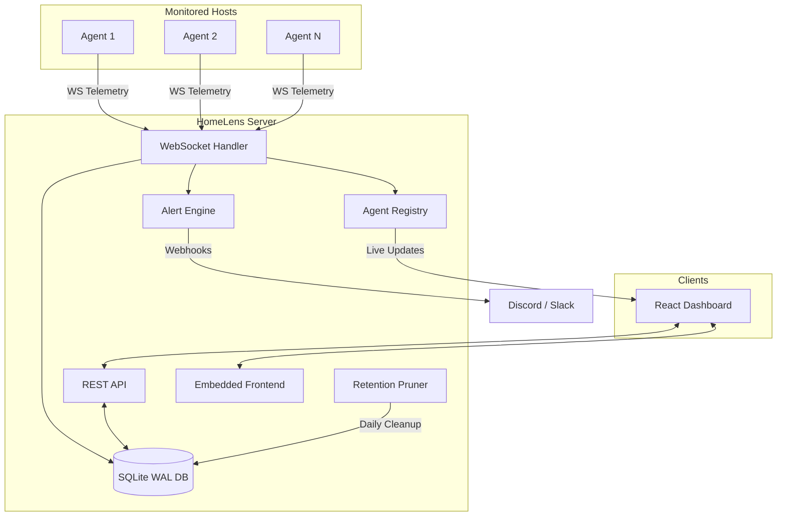
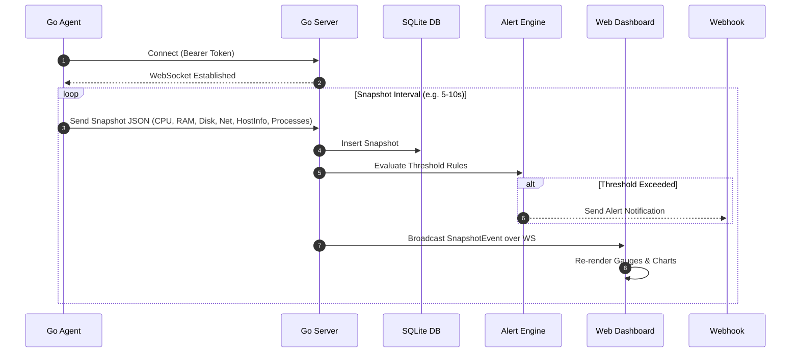

# HomeLens

HomeLens is a lightweight real-time server monitoring tool written in Go and React. It collects host hardware metrics via background agents streaming over WebSockets and renders them on a web dashboard embedded into a single Go binary.

## Features

- **Lightweight Go Agent**: Compiles to a static `CGO_ENABLED=0` binary with minimal resource footprint.
- **Real-Time Streaming**: Uses WebSockets to push metrics (CPU, RAM, Disk IO, Network, Temperatures, Docker containers, Top processes) to the dashboard.
- **Single-Binary Server**: The React frontend is compiled and embedded into the Go server using `go:embed`.
- **SQLite Storage**: Uses SQLite in WAL mode with an automatic worker that prunes snapshot data older than 30 days.
- **Alerting & Webhooks**: Triggers webhook notifications (Discord, Slack, etc.) when CPU, Memory, Disk usage, or host offline thresholds are exceeded.
- **Remote Agent Deployment**: Included Bash script builds the agent and sets up a `systemd` service over SSH.

---

## Architecture



### Telemetry Sequence



---

## Quickstart

Start the server using Docker Compose:

```bash
docker compose up -d
```

The web dashboard will be available at `http://localhost:8080`.

---

## Configuration

Server and agent options are configured via environment variables or a `.env` file:

| Variable | Target | Default | Description |
| :--- | :--- | :--- | :--- |
| `HOMELENS_AUTH_TOKEN` | Server / Client | *(Required)* | Secret token for agent authentication. |
| `HOMELENS_SERVER_ADDR` | Server | `:80` (Docker) / `localhost:8080` | Address for the Go server to bind to. |
| `HOMELENS_PORT` | Docker Compose | `8080` | External host port mapped in Docker Compose. |
| `HOMELENS_CORS_ORIGIN` | Server | `*` | Allowed CORS origins. |
| `HOMELENS_DB_PATH` | Server | `data/homelens.db` | Path to the SQLite database file. |
| `HOMELENS_SECONDS_INTERVAL` | Client | `10` | Interval (in seconds) between agent telemetry snapshots. |

---

## Deploying Agents

Deploy an agent to a remote Linux machine using `deploy_client.sh`:

```bash
./deploy_client.sh <user@remote-ip> <auth-token> <server-ws-url> <interval-seconds>
```

Example:

```bash
./deploy_client.sh ubuntu@192.168.1.50 33f528bd3e948d7a6654c9240103f7f6ba3c26798f4796eb528d9ba587a7bc5a ws://192.168.1.100:8080/ws 5
```

The script cross-compiles `homelens-agent` for Linux, transfers it over SCP, and configures a `systemd` service (`homelens-agent.service`).

---

## Testing

Run unit tests and load tests:

```bash
./run_tests.sh
```

Load tests use `k6` ([`loadtest.js`](file:///home/luizg/Documents/Personal/Projects/homelens/loadtest.js)) to simulate multiple agent WebSocket connections.

---

## Local Development

### Prerequisites
- **Go** >= 1.26
- **Node.js** >= 18 or **Bun**

### Build Frontend
```bash
cd ui
npm install
npm run build
cd ..
```

### Run Server
```bash
HOMELENS_AUTH_TOKEN=dev-token HOMELENS_SERVER_ADDR=localhost:8080 go run ./cmd/server/main.go
```

### Run Client Agent
```bash
HOMELENS_AUTH_TOKEN=dev-token HOMELENS_SERVER_ADDR=ws://localhost:8080/ws HOMELENS_SECONDS_INTERVAL=5 go run ./cmd/client/main.go
```

---

## License

MIT License. See `LICENSE` for details.
